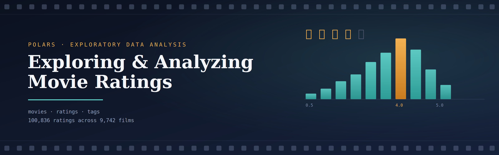
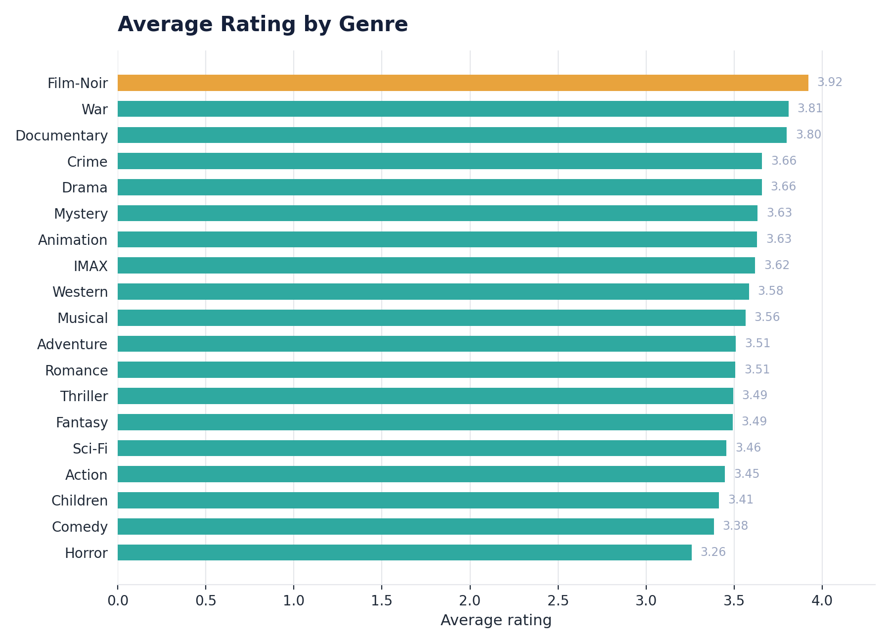
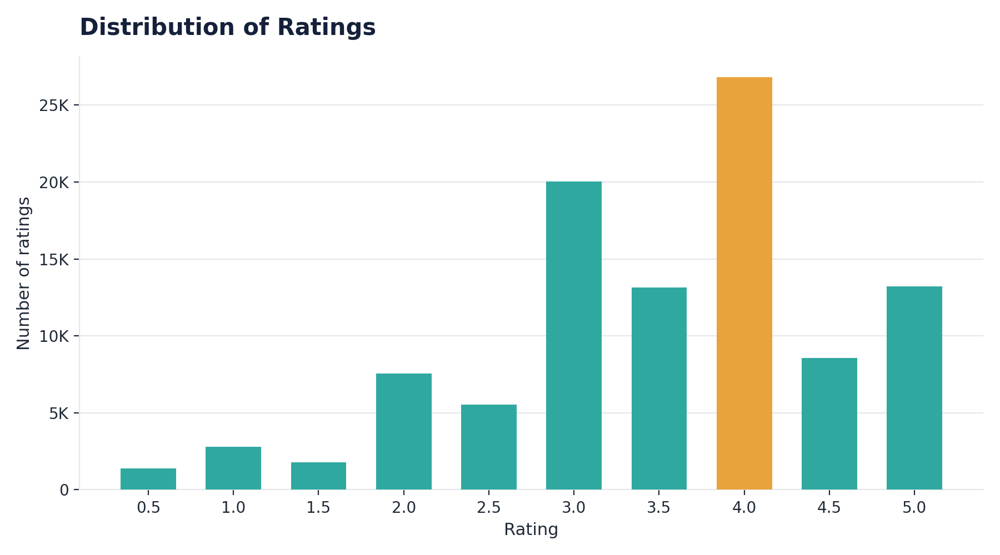
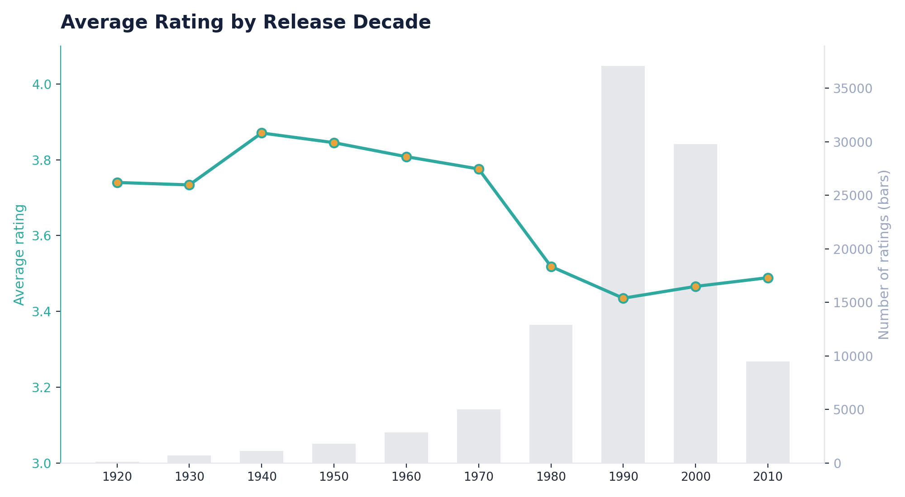

<p align="center">
  
</p>

<h1 align="center">Exploring & Analyzing Movie Ratings with Polars</h1>

<p align="center">
  A full data cleaning + exploratory data analysis project on the MovieLens dataset,<br>
  built entirely with <a href="https://pola.rs">Polars</a> instead of pandas.
</p>

<p align="center">
  
  
  
  
</p>

---

## About

This project takes three raw, linked CSV files — movies, ratings, and tags from the [MovieLens](https://grouplens.org/datasets/movielens/) dataset — and works through the full pipeline of a real analytics task: inspecting the data, cleaning it (including a couple of missing values that don't look like missing values), and then answering a series of questions about rating patterns, genres, users, and tags.

It's built with **Polars** rather than pandas, mainly to get properly comfortable with its expression API — lazy evaluation, `group_by`/`agg`, `explode`, and multi-table joins all get real use here, not just a toy example.

## Dataset

| File | Rows | Columns | Description |
|---|---|---|---|
| `movies.csv` | 9,742 | `movie_id`, `title`, `genres` | One row per movie, genres pipe-separated |
| `ratings.csv` | 100,836 | `user_id`, `movie_id`, `rating`, `timestamp` | One row per rating (0.5–5.0, half-star increments) |
| `tags.csv` | 3,683 | `user_id`, `movie_id`, `tag`, `timestamp` | One row per free-text tag a user applied to a movie |

`movie_id` links all three tables; `user_id` additionally links `ratings` and `tags`.

## What's inside

- **Step 1 — Load & inspect**: shape, schema, and a first look at all three tables
- **Step 2 — Preprocess**: type fixes, a hidden missing value hiding in plain sight (`"(no genres listed)"`), duplicate checks at both the row level and the key level, and a genre column split into a proper list
- **Step 3 — Analysis**: 16 required questions across three difficulty tiers (rating sanity checks, per-genre and per-user breakdowns, most/least-rated movies, tag statistics, high-rating proportions, correlation analysis)
- **Beyond the brief**: release year extraction, rating trends by decade, "most polarizing" movies by rating spread, and a look at whether tagging activity tracks rating activity

## Highlights

**Genres split more by mood than by mainstream appeal.** Film-Noir and War top the average-rating table — genres far from the most-rated, which says more about who chooses to watch (and rate) them than about genre "quality."

<p align="center"></p>

**Most ratings cluster around whole-star values**, and whole stars consistently outscore the half-star just below them (4.0 clearly beats 3.5, 3.0 beats 2.5) — a small but visible rounding habit in how people rate.

<p align="center"></p>

**Older decades average higher ratings — but it's likely survivorship bias, not nostalgia or quality.** 1940s/50s films sit near 3.85 average, versus ~3.45 for 1990s/2000s releases. The catch: older decades have only a handful of ratings each (bar heights below), so what's left rated today is mostly the acknowledged classics — not a random sample of everything released back then.

<p align="center"></p>

**Popularity and rating quality are only weakly linked.** The correlation between how many ratings a movie gets and its average score comes out to roughly **0.11** — real, but far too weak to say popular movies are meaningfully "better" rated than niche ones.

**The dataset is unusually clean.** No duplicates at any level — not just exact row matches, but also duplicate keys (`movie_id`, `(user_id, movie_id)` pairs) and near-duplicate tags once case and whitespace are normalized.

## Project structure

```
├── movie_ratings_polars_analysis.ipynb   # the full notebook — cleaning + all analysis
├── movies.csv                            # raw data
├── ratings.csv                           # raw data
├── tags.csv                              # raw data
├── assets/
│   ├── movie_ratings_polars_cover.png
│   ├── genre_avg_rating.png
│   ├── rating_distribution.png
│   └── ratings_by_decade.png
└── README.md
```

## Running it

```bash
git clone https://github.com/<your-username>/<repo-name>.git
cd <repo-name>
pip install polars jupyter
jupyter notebook movie_ratings_polars_analysis.ipynb
```

Or open it directly in [Google Colab](https://colab.research.google.com) and point the file paths at wherever `movies.csv`, `ratings.csv`, and `tags.csv` end up (e.g. a mounted Google Drive folder).

## Built with

- [Polars](https://pola.rs) — dataframe library
- [MovieLens](https://grouplens.org/datasets/movielens/) — dataset (ml-latest-small)
- Jupyter / Google Colab
